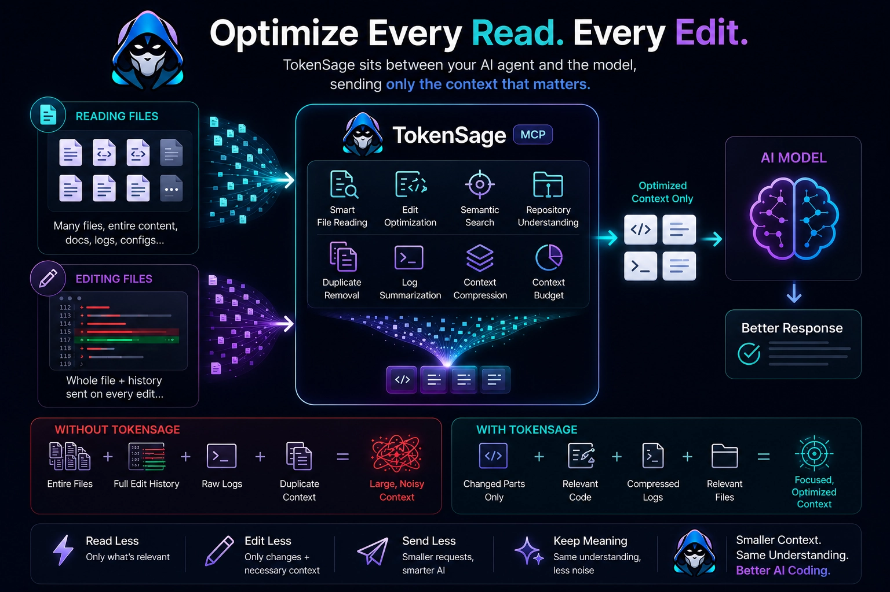
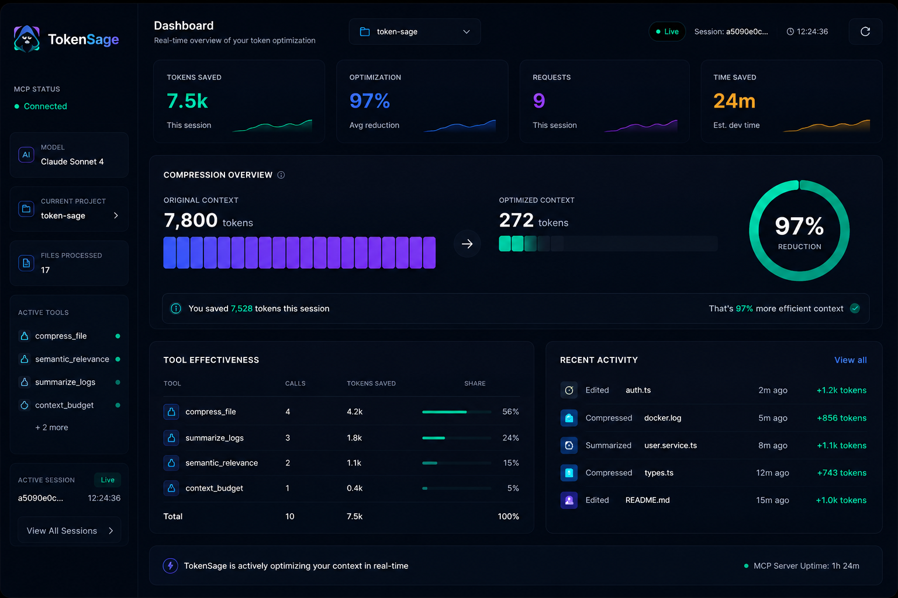

<p align="center">
  
</p>

<h1 align="center">TokenSage</h1>

<p align="center">
  <strong>MCP server that slashes LLM token usage — transparently, in real time.</strong><br/>
  Every file read, bash call, and prompt is compressed before the LLM ever sees it. Zero workflow changes.
</p>

<p align="center">
  <a href="https://www.npmjs.com/package/token-sage"></a>
  <a href="https://github.com/ShivamDalsaniya/TokenSage/blob/master/LICENSE"></a>
  
  
</p>

<p align="center">
  Works with <strong>Claude Code</strong> · <strong>Cursor</strong> · <strong>Codex CLI</strong> · <strong>Cline</strong> · <strong>Roo Code</strong> · <strong>Gemini CLI</strong> · <strong>OpenCode</strong> · any MCP client
</p>

---

## What is TokenSage?

TokenSage is a [Model Context Protocol (MCP)](https://modelcontextprotocol.io) server that sits between your AI client and the LLM. It intercepts every file read, bash command, and conversation turn — compressing the content before the model sees it — then tracks exactly how many tokens were saved using **real encoding**, not estimates.

> **167,000 tokens saved in a single session — measured, not estimated.**

Token counts use **gpt-tokenizer (cl100k_base)** on actual before/after text. Every number in the dashboard is a real measurement.

## How It Works



---

## Quick Start

**Recommended — one command setup:**
```bash
npm install -g token-sage
tokensage install
```

`tokensage install` automatically adds the MCP server and all hooks to your Claude Code settings. Restart Claude Code — done.

**No install (npx):**
```bash
npx token-sage
```

**From source:**
```bash
git clone https://github.com/ShivamDalsaniya/TokenSage.git
cd TokenSage
npm install --legacy-peer-deps && npm run build
npm start
```

---

## Client Compatibility

| Feature | Claude Code | Cursor | Codex CLI | Cline | Gemini CLI | Roo Code |
|---------|:-----------:|:------:|:---------:|:-----:|:----------:|:--------:|
| MCP Tools (compress, summarize…) | ✓ | ✓ | ✓ | ✓ | ✓ | ✓ |
| Auto hooks (compress every read) | ✓ | — | — | — | — | — |
| Real-time dashboard | ✓ | ✓ | ✓ | ✓ | ✓ | ✓ |

**Hooks** (automatic per-read compression) require Claude Code's hook system. All other clients get MCP tools + dashboard — still significant savings when used explicitly.

---

## How It Works

TokenSage compresses context through two layers.

### Layer 1: Hooks (Automatic — Claude Code only)

Registered once. Fire on every tool call. You never change a prompt.

| Hook | Trigger | What it does | Savings |
|------|---------|--------------|---------|
| `auto_compress_read` | Before every `Read` | Returns structural skeleton instead of full source | 50–99% |
| `post_bash` | After every `Bash` | Trims verbose stdout, keeps errors | 60–80% |
| `edit_operation` | After `Edit` / `Write` | Tracks diff savings vs full file write | Analytics |
| `user_prompt` | Before each prompt | Compresses large inline code blocks | 40–70% |

**Supported languages:** TypeScript · JavaScript · Python · Go · Rust · Java · C/C++ · C# · Ruby · PHP · Swift · Kotlin · Scala · Vue · Svelte

### Layer 2: MCP Tools (All clients)

Call these explicitly inside your AI client for deeper, targeted compression.

| Tool | What it does | Savings |
|------|-------------|---------|
| `compress_file` | Source code → symbols + imports + exports skeleton | 60–90% |
| `compress_directory` | Repo → architecture + dependency graph + key files | 70–95% |
| `summarize_logs` | Raw logs → status + unique errors + action summary | 80–95% |
| `summarize_conversation` | Long chat → goals + tasks + decisions + blockers | 60–85% |
| `detect_duplicates` | Remove repeated stack traces and duplicate chunks | 50–90% |
| `semantic_relevance` | Rank files by query — load only what matters | 70–95% |
| `context_budget` | Calculate token cost, fit context within budget | Analytics |
| `token_usage_report` | Full session + all-time savings report | Analytics |

---

## Live Dashboard



The real-time dashboard shows:

- **Tokens saved** — live count for the current session
- **Optimization %** — average reduction across all tool calls
- **Requests** — total compressions this session
- **Time saved** — estimated developer time at 300 tokens/min
- **Tool effectiveness** — per-tool breakdown with call counts
- **Recent activity** — live feed of every compression with before/after sizes

Port is **auto-computed per project** (hash of project path, range 7450–7999) — multiple projects each get their own dashboard with no conflicts.

---

## Installation

### Claude Code — Automatic (Recommended)

```bash
npm install -g token-sage
tokensage install
```

Restart Claude Code. Everything is wired automatically.

### Claude Code — Manual

Add to `~/.claude/settings.json`:

```json
{
  "mcpServers": {
    "token-sage": {
      "command": "npx",
      "args": ["token-sage"]
    }
  },
  "hooks": {
    "PreToolUse": [
      {
        "matcher": "Read",
        "hooks": [{ "type": "command", "command": "npx token-sage hook:pre-read" }]
      },
      {
        "matcher": "Write",
        "hooks": [{ "type": "command", "command": "npx token-sage hook:pre-write" }]
      }
    ],
    "PostToolUse": [
      {
        "matcher": "Edit",
        "hooks": [{ "type": "command", "command": "npx token-sage hook:post-tool-edit" }]
      },
      {
        "matcher": "Write",
        "hooks": [{ "type": "command", "command": "npx token-sage hook:post-tool-edit" }]
      },
      {
        "matcher": "Bash",
        "hooks": [{ "type": "command", "command": "npx token-sage hook:post-bash" }]
      }
    ],
    "SessionStart": [
      {
        "hooks": [{ "type": "command", "command": "npx token-sage hook:session-start" }]
      }
    ],
    "UserPromptSubmit": [
      {
        "hooks": [{ "type": "command", "command": "npx token-sage hook:user-prompt" }]
      }
    ]
  }
}
```

Restart Claude Code.

### Cursor

Add to `~/.cursor/mcp.json`:

```json
{
  "mcpServers": {
    "token-sage": {
      "command": "npx",
      "args": ["token-sage"]
    }
  }
}
```

### Codex CLI

```bash
codex mcp add token-sage npx token-sage
```

### Gemini CLI

```bash
gemini mcp add token-sage -- npx token-sage
```

### Cline / Roo Code

In the MCP settings panel: command `npx`, args `token-sage`.

### Any MCP Client

```json
{
  "command": "npx",
  "args": ["token-sage"]
}
```

---

## Token Counting — Real Data, Not Estimates

Token counts use **gpt-tokenizer** (`cl100k_base`) on actual before/after text — same tokenizer as GPT-4, closely matching Claude's tokenization:

```typescript
import { encode } from 'gpt-tokenizer';

export function countTokens(text: string): number {
  return encode(text).length; // real encoding, not character ratios
}
```

Every hook runs `countTokens(original)` and `countTokens(compressed)`, stores both, and reports the real difference. No estimates, no heuristics.

---

## Configuration

| Variable | Default | Description |
|----------|---------|-------------|
| `DASHBOARD_PORT` | auto | Dashboard port (auto-computed from project path hash) |
| `DASHBOARD_HOST` | `localhost` | Dashboard bind host |
| `DASHBOARD_ENABLED` | `true` | Enable or disable the dashboard |
| `TOKENSAGE_NO_COMPRESS` | — | Set to `1` to disable auto-compression |
| `TOKENSAGE_COMPRESS_THRESHOLD` | `100` | Min lines before compressing a file |
| `TOKENSAGE_MIN_SAVINGS_PCT` | `15` | Min savings % before blocking a read |
| `LOG_LEVEL` | `info` | Logging verbosity |
| `MAX_FILE_SIZE_BYTES` | `512000` | Max file size for analysis (512 KB) |

---

## Development

```bash
npm run dev          # Run with tsx — no build needed
npm run build        # Compile TypeScript to dist/
npm test             # Run test suite
npm run typecheck    # tsc --noEmit
npm run lint         # ESLint
```

### Project Structure

```
src/
├── server/
│   ├── index.ts              # MCP stdio server + hook routing (npx token-sage hook:*)
│   └── dashboard.ts          # Fastify web dashboard (real-time)
├── hooks/
│   ├── pre-read.ts           # Intercepts Read — compresses large files
│   ├── pre-write.ts          # Guards against unnecessary full rewrites
│   ├── post-bash.ts          # Trims verbose bash output
│   ├── post-tool-edit.ts     # Tracks edit/write token savings
│   ├── user-prompt.ts        # Compresses inline code blocks in prompts
│   └── session-start.ts      # Launches dashboard, registers session
├── tools/                    # MCP tool handlers (compress, summarize, etc.)
├── compression/              # Code + log compressors (multi-language)
├── analytics/                # Token counter + session tracker
├── daemon/                   # Background daemon for cross-session tracking
└── config/                   # Configuration + port computation
```

---

## Contributing

PRs welcome. Before submitting:

```bash
npm test          # Tests must pass
npm run typecheck # Zero TypeScript errors
npm run lint      # Zero lint warnings
```

---

## License

MIT — © 2025 Shivam Dalsaniya
