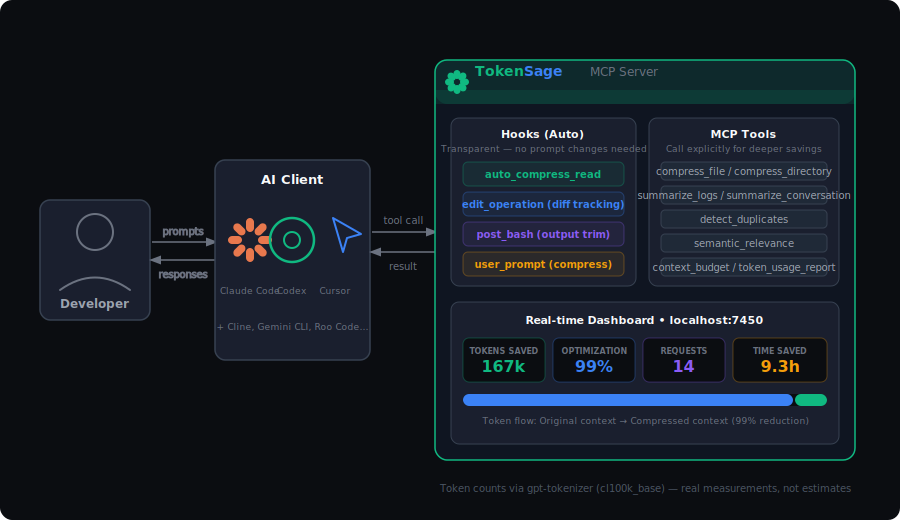

<p align="center">
  
</p>

<h1 align="center">TokenSage</h1>

<p align="center">
  <strong>MCP server that slashes LLM token usage by 50–99% — transparently, in real time.</strong>
</p>

<p align="center">
  <a href="https://www.npmjs.com/package/token-sage"></a>
  <a href="https://github.com/ShivamDalsaniya/TokenSage/blob/main/LICENSE"></a>
  
  
</p>

<p align="center">
  Works with Claude Code · Cursor · Codex CLI · Cline · Roo Code · Gemini CLI · OpenCode
</p>

---

TokenSage is a [Model Context Protocol (MCP)](https://modelcontextprotocol.io) server that intercepts large file reads, bash output, and conversation context — compressing them before they reach the LLM. Token counts are measured using **gpt-tokenizer (cl100k_base) on actual text**, not estimates.

> **Real-world result:** 167,000 tokens saved in a single session — measured, not estimated.

## Quick Demo

<!-- Record a screen capture of the dashboard and upload to this repo, then uncomment:
https://github.com/ShivamDalsaniya/TokenSage/assets/YOUR_ASSET_ID/demo.mp4
-->


## How It Works

TokenSage installs as two layers:

**1. Hooks (automatic, no prompts needed)**
- Intercepts every `Read` tool call on code files → returns compressed structural skeleton instead of full file
- Tracks bash output length → trims verbose stdout before Claude sees it
- Compresses user prompts containing large fenced code blocks

**2. MCP Tools (call explicitly for deeper compression)**
- `compress_file`, `compress_directory` — structural skeletons with symbols, imports, exports
- `summarize_logs`, `summarize_conversation` — deduplicated summaries
- `detect_duplicates`, `semantic_relevance` — reduce redundant context
- `context_budget`, `token_usage_report` — analytics and budget enforcement

**3. Real-time Dashboard**
- Live token savings, optimization %, time saved, per-tool breakdown
- Accessible at `http://localhost:7450`

## Architecture



## Quick Start

**Via npx (no install needed):**
```bash
npx token-sage
```

**Via npm global install:**
```bash
npm install -g token-sage
token-sage
```

**From source:**
```bash
git clone https://github.com/ShivamDalsaniya/TokenSage.git
cd TokenSage
npm install && npm run build
npm start
```

Dashboard opens at **http://localhost:7450**

## Installation

### Claude Code

Add to `~/.claude/settings.json` (Settings → MCP Servers):

```json
{
  "mcpServers": {
    "token-sage": {
      "command": "npx",
      "args": ["token-sage"]
    }
  }
}
```

Or with a local build:
```json
{
  "mcpServers": {
    "token-sage": {
      "command": "node",
      "args": ["/path/to/TokenSage/dist/server/index.js"]
    }
  }
}
```

**Add hooks** to `~/.claude/settings.json` for automatic compression:
```json
{
  "hooks": {
    "PreToolUse": [
      {
        "matcher": "Read",
        "hooks": [{ "type": "command", "command": "npx token-sage hook:pre-read" }]
      },
      {
        "matcher": "Write|Edit",
        "hooks": [{ "type": "command", "command": "npx token-sage hook:pre-write" }]
      }
    ],
    "PostToolUse": [
      {
        "matcher": "Bash",
        "hooks": [{ "type": "command", "command": "npx token-sage hook:post-bash" }]
      }
    ],
    "SessionStart": [
      {
        "hooks": [{ "type": "command", "command": "npx token-sage hook:session-start" }]
      }
    ]
  }
}
```

Then restart Claude Code.

### Cursor

Add to `.cursor/mcp.json` in your project root:
```json
{
  "mcpServers": {
    "token-sage": {
      "command": "npx",
      "args": ["token-sage"]
    }
  }
}
```

### Codex CLI
```bash
codex mcp add token-sage npx token-sage
```

### Cline / Roo Code

In the MCP settings panel, add a new server:
- **Command:** `npx`
- **Args:** `token-sage`

### Gemini CLI
```bash
gemini mcp add token-sage -- npx token-sage
```

## Features

| Tool | What it does | Typical savings |
|------|-------------|----------------|
| `compress_file` | Source code → purpose + symbols + imports + exports skeleton | 60–90% |
| `compress_directory` | Repo → architecture + dependency graph + key files | 70–95% |
| `summarize_logs` | Raw logs → status + unique errors + action summary | 80–95% |
| `summarize_conversation` | Long chat → goals + tasks + decisions + blockers | 60–85% |
| `detect_duplicates` | Remove repeated stack traces and duplicate chunks | 50–90% |
| `semantic_relevance` | Rank files by query relevance — load only what matters | 70–95% |
| `context_budget` | Calculate token cost and fit context within a budget | Analytics |
| `token_usage_report` | Session + all-time savings report | Analytics |

**Supported languages for structural compression:**
TypeScript · JavaScript · Python · Go · Rust · Java · C/C++ · C# · Ruby · PHP · Swift · Kotlin · Scala · Vue · Svelte

## Dashboard

The live dashboard at `http://localhost:7450` shows:

- **Tokens saved** — current session and all-time
- **Optimization %** — average reduction across all tool calls
- **Requests** — total tool calls processed this session
- **Time saved** — estimated developer time (at 300 tokens/min reading speed)
- **Tool effectiveness** — per-tool breakdown with call count, tokens saved, share %
- **Recent activity** — live feed of every compression event
- **Session management** — all active sessions with live indicator, auto-expire after 48h

## Token Counting — Is the Data Real?

Yes. Token counts use **gpt-tokenizer** (`cl100k_base` encoding) on actual before/after text:

```typescript
// src/analytics/token-counter.ts
export function countTokens(text: string): number {
  return encode(text).length; // gpt-tokenizer, same tokenizer as GPT-4/Claude
}
```

Every compression hook measures original and optimized token counts using real encoding. The dashboard displays real measurements — not estimates, not ratios.

## Environment Variables

| Variable | Default | Description |
|----------|---------|-------------|
| `DASHBOARD_PORT` | `7450` | Dashboard HTTP port |
| `DASHBOARD_HOST` | `localhost` | Dashboard bind host |
| `DASHBOARD_ENABLED` | `true` | Enable/disable dashboard |
| `TOKENSAGE_NO_COMPRESS` | — | Set to `1` to disable auto-compression |
| `TOKENSAGE_COMPRESS_THRESHOLD` | `100` | Min lines before compressing a file |
| `TOKENSAGE_MIN_SAVINGS_PCT` | `15` | Min savings % before blocking a read |
| `LOG_LEVEL` | `info` | Logging verbosity |
| `MAX_FILE_SIZE_BYTES` | `512000` | Max file size for analysis |

## Development

```bash
npm run dev          # Run with tsx (no build needed)
npm run build        # Compile TypeScript
npm test             # Run test suite (83 tests)
npm run test:watch   # Watch mode
npm run lint         # ESLint
npm run typecheck    # tsc --noEmit
```

## Project Structure

```
src/
├── server/
│   ├── index.ts          # MCP stdio server + tool registration
│   └── dashboard.ts      # Fastify web dashboard (real-time)
├── hooks/
│   ├── pre-read.ts       # Intercepts Read tool — compresses large code files
│   ├── pre-write.ts      # Tracks write/edit operations
│   ├── post-bash.ts      # Trims verbose bash output
│   ├── user-prompt.ts    # Compresses prompts with large code blocks
│   └── session-start.ts  # Registers session with daemon
├── tools/
│   ├── compress-file.ts
│   ├── compress-directory.ts
│   ├── summarize-logs.ts
│   ├── summarize-conversation.ts
│   ├── detect-duplicates.ts
│   ├── semantic-relevance.ts
│   ├── context-budget.ts
│   └── token-usage-report.ts
├── compression/
│   ├── code-compressor.ts   # File → structural skeleton (multi-language)
│   └── log-compressor.ts    # Logs → deduplicated summary
├── analytics/
│   ├── token-counter.ts     # gpt-tokenizer cl100k_base counting
│   └── session-tracker.ts   # Session stats accumulator
├── parsers/
│   └── code-parser.ts       # Multi-language AST-like parser (tree-sitter)
├── daemon/
│   ├── index.ts             # Background daemon for cross-session tracking
│   └── session-manager.ts   # Session registry with 48h auto-expire
└── config/
    └── index.ts             # Configuration + env vars
```

## Live Demo

> **Want to add a demo video?**
>
> 1. Record your screen with QuickTime (Mac) or OBS showing the dashboard and Claude Code side-by-side
> 2. In this GitHub repo, create an Issue → drag the `.mp4` into the comment box → copy the CDN URL GitHub generates
> 3. Paste the URL in this README under a `## Quick Demo` section — GitHub renders it as an inline video player

## Contributing

Pull requests welcome. Before submitting:
```bash
npm test          # All 83 tests must pass
npm run typecheck # Zero TypeScript errors
npm run lint      # Zero lint warnings
```

## License

MIT — © 2025 Shivam Dalsaniya
